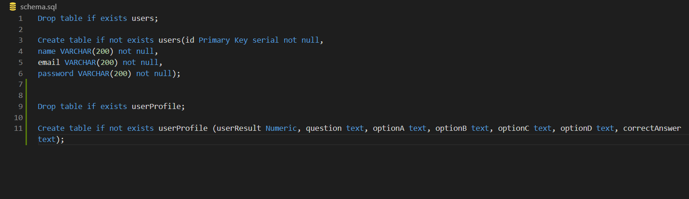

# MR.Quiz

### Problem Domain:
Generate questions for the users to test their IQ and knowledge.

### What our App do:
To provide questions from different fields (Science, Math, history, Art) that will help the user to test their general knowledge or to create quiz's for different proposes.

### WireFrame:

### Non-functional requirement: 
Non-functional requirement: are the requirements that describe operational qualities rather than a behavior of the product.

Security : We aim to save the users data and created quizzes in secure way, for example using bcrypt hash method.

Usability : Our website will be easy to use and read by users, for example by using clean and pleasant CSS.

### Team Members:
Qusai Qishta

Malak Al-Momani

Nihad Zeidan

Suhib Kharoush

Duha Yousef

