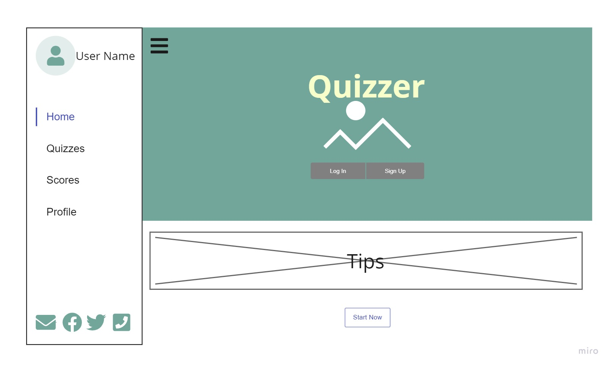
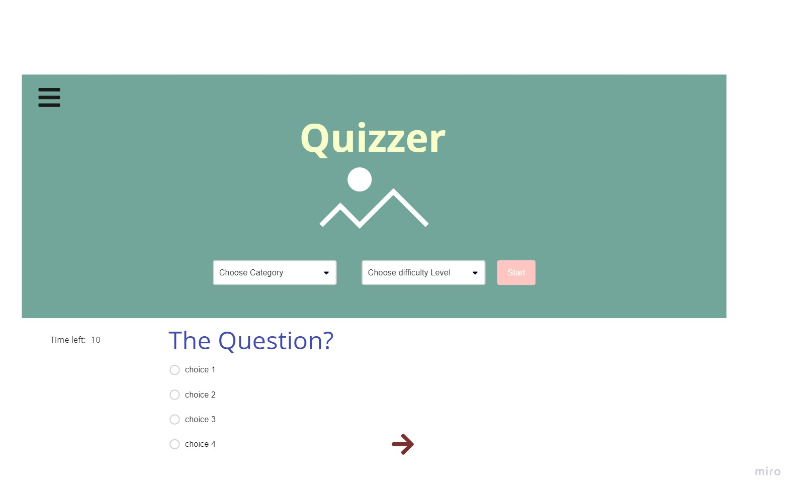

# MR.Quiz

### Problem Domain:
Generate questions for the users to test their IQ and knowledge.

### What our App do:
To provide questions from different fields (Science, Math, history, Art) that will help the user to test their general knowledge or to create quiz's for different proposes.

### Model Flow:
1- First the user will see the home page with login or register buttons.
2- The user must be registered in the website to continue.
3- In the register page the user will be required to add his/her info.
4- After registering the information will be saved safely in our DB and the user will go to login page, and enter his/her email and pass.
5- The user profile page will render after he/she login successfully.
6- In the profile page the user can start a quiz after choose the category type and difficulty level.
7- The quiz will have a timer in it, and after finishing the result will be stored 8- In the DB and appear to the user.
9- In the profile page the user will be able to add his/her own question and edit or delete these questions.

### WireFrame:

### Non-functional requirement: 
Non-functional requirement: are the requirements that describe operational qualities rather than a behavior of the product.

Security : We aim to save the users data and created quizzes in secure way, for example using bcrypt hash method.

Usability : Our website will be easy to use and read by users, for example by using clean and pleasant CSS.

### Team Members:
Qusai Qishta

Malak Al-Momani

Nihad Zeidan

Suhib Kharoush

Duha Yousef

